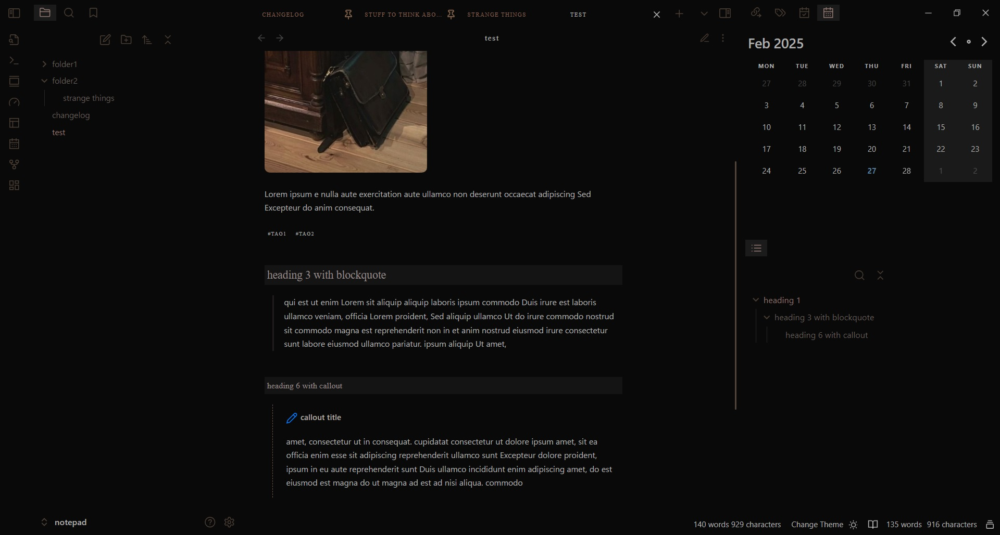

# aged whisky

Elegant, minimalist dark theme.

No app borders, images with rounded corners, styled links, fancy headings in reading mode.

Narrow editor in reading mode (550px).

Due to editor styling, should be always used with a left sidebar, otherwise you'll have the file contents on the far left border of the screen.

Update: The readable line length now uses a less aggressive method and will no longer override snippets that change the width, such as wide view.

dark mode only:

